# LMD — University Grade Management

A React + TypeScript + Vite application for managing student grades and academic results under the **LMD (Licence-Master-Doctorat)** system, built for the National School of Computer Science at the University of Fianarantsoa, Madagascar.

## ✨ Features

| Module | Capabilities |
|--------|-------------|
| **Students** | Create, read, update, delete student records |
| **Levels (Niveau)** | Manage academic levels, domains, mentions, and tracks |
| **UE (Teaching Units)** | Define teaching units with credits |
| **EC (Course Elements)** | Configure course elements with coefficients (ET/ED/EP), credits, and weights |
| **Grades (Notes)** | Add, edit, delete grades with individual or global entry |
| **Results** | Search individual student results or aggregate level results |
| **PDF** | Generate printable transcripts and level result sheets |
| **Dark Mode** | Full dark theme support |

### UX Highlights
- Form validation with Yup + React Hook Form
- Lazy-loaded routes for fast initial load
- Data caching with TanStack React Query
- Responsive layout (mobile-friendly tables and forms)

## 🚀 Getting Started

### Prerequisites
- Node.js 18+
- npm or yarn

### Installation

```bash
git clone <repository_url>
cd lmd-front
npm install
```

### Development

```bash
npm run dev
```

### Production Build

```bash
npm run build
```

## 📸 Screenshots

### Login

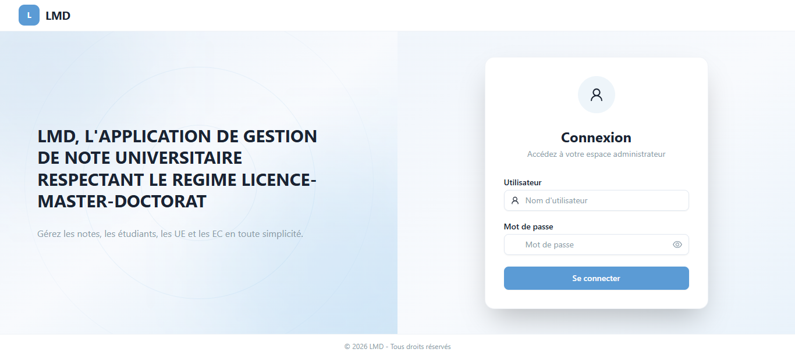 · 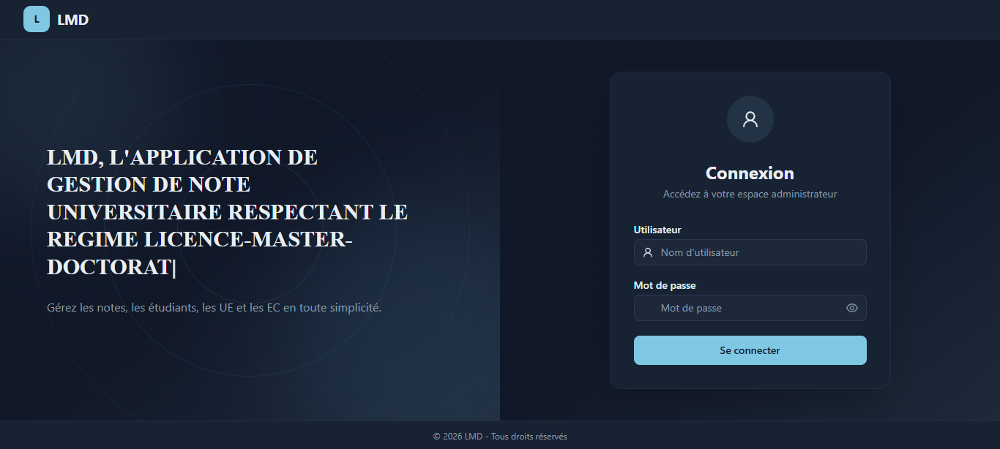

### Dashboard

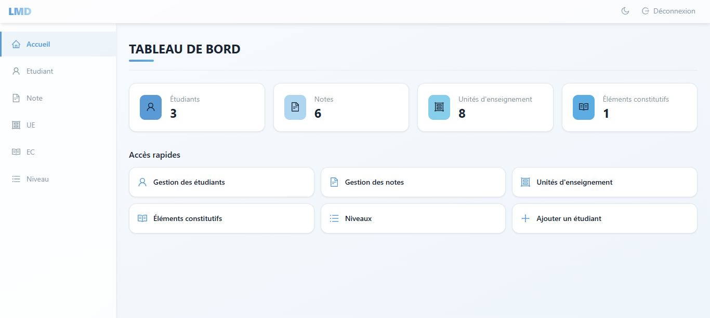 — _Tableau de bord_

### Student Management

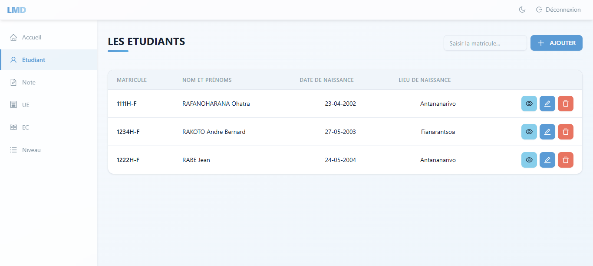 · 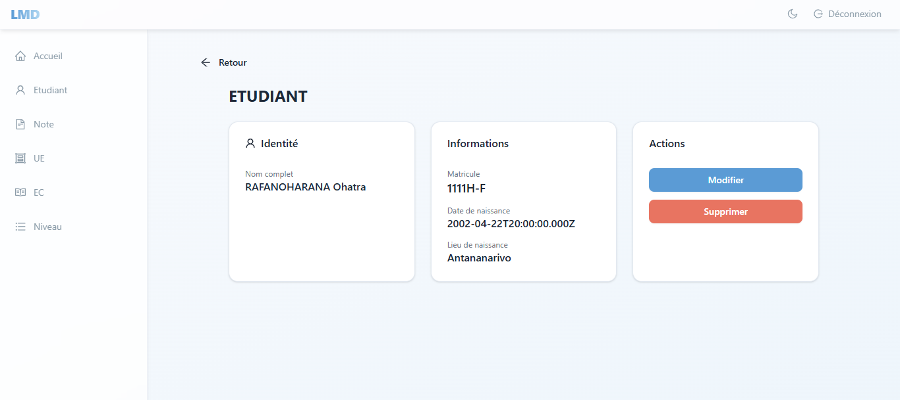

### Level Management

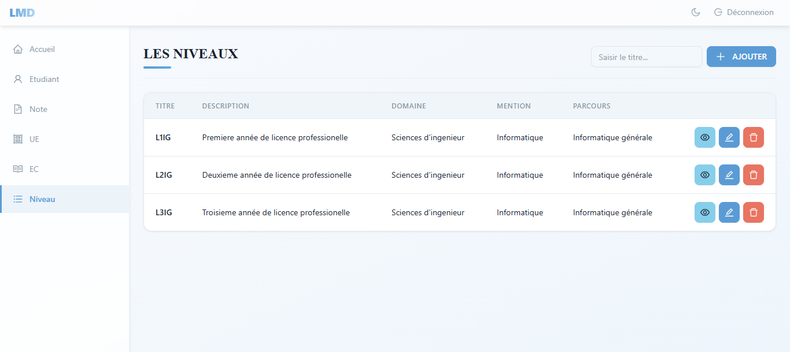 · 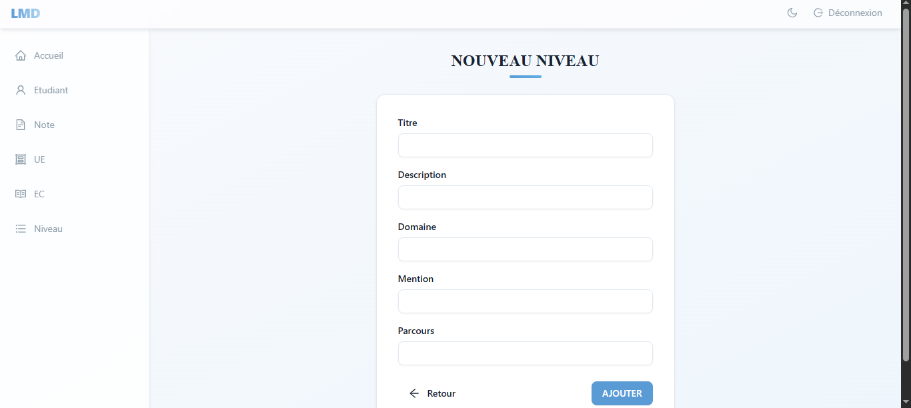 · 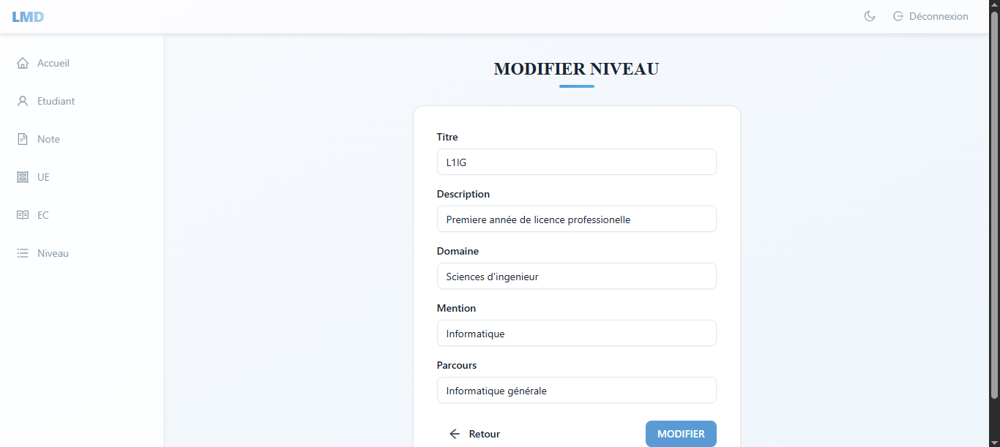 · 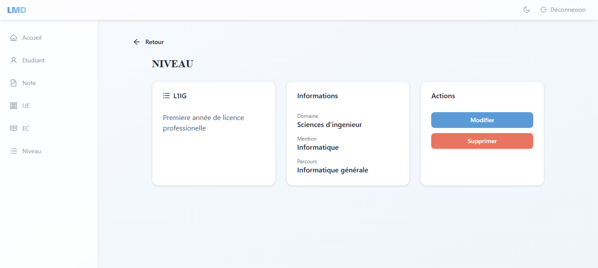

### UE (Teaching Unit) Management

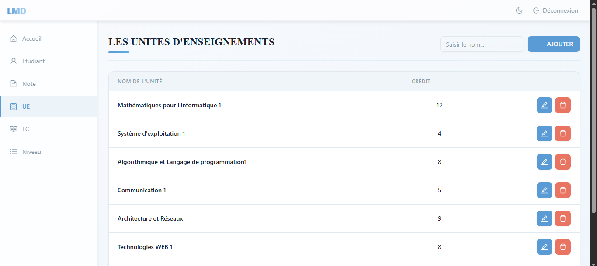 · 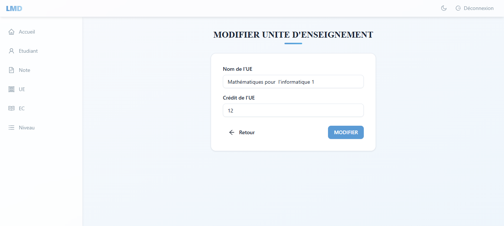

### EC (Course Element) Management

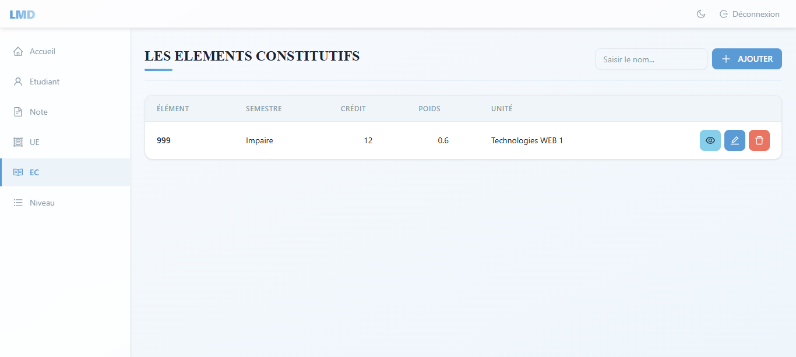 · 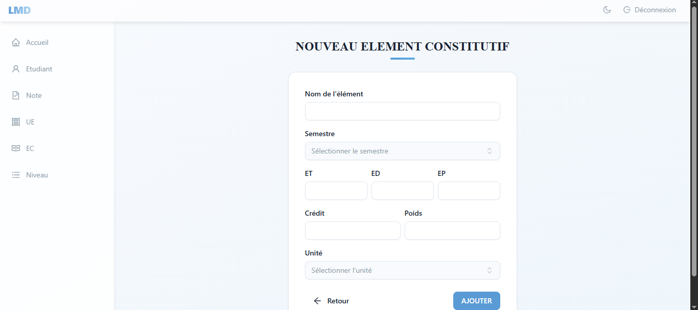 · 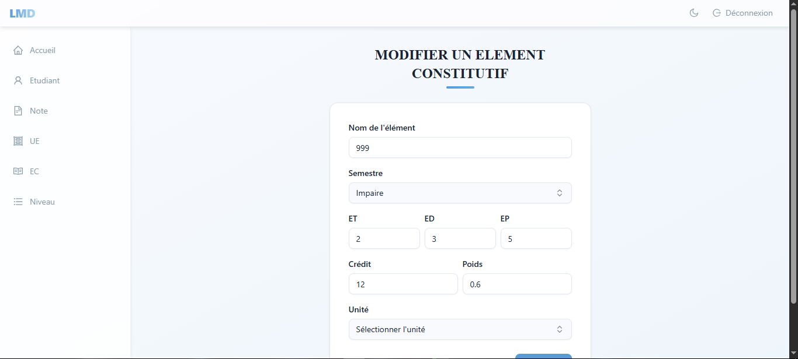 · 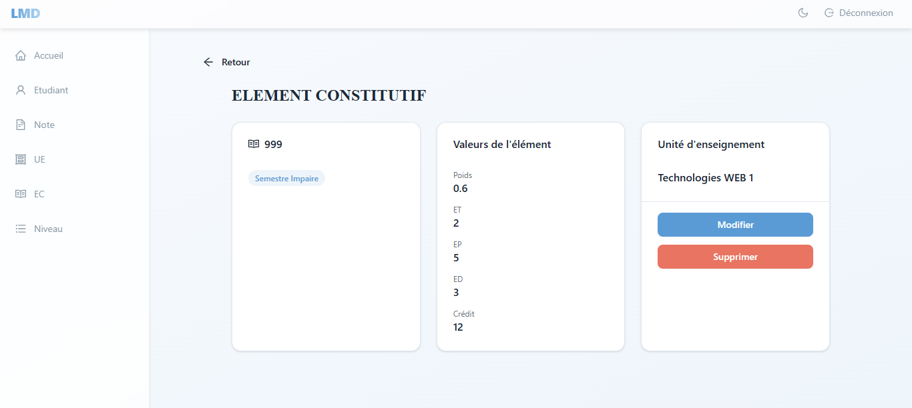

### Grade Management

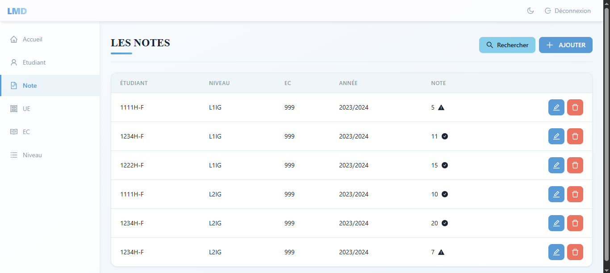 · 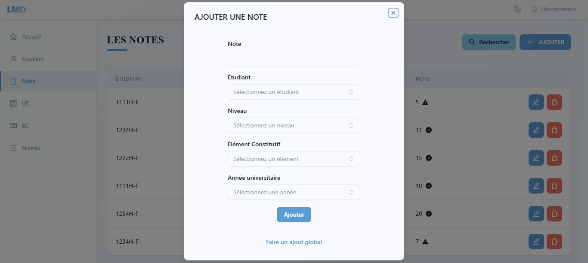 · 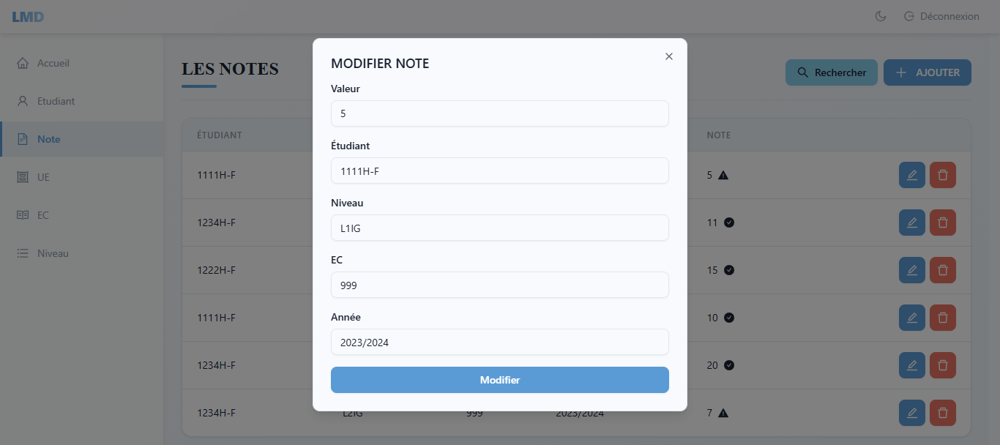 · 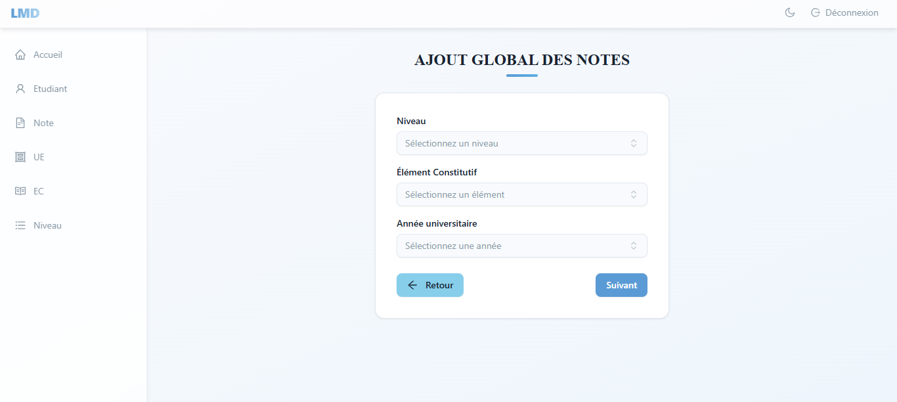

### Result Search

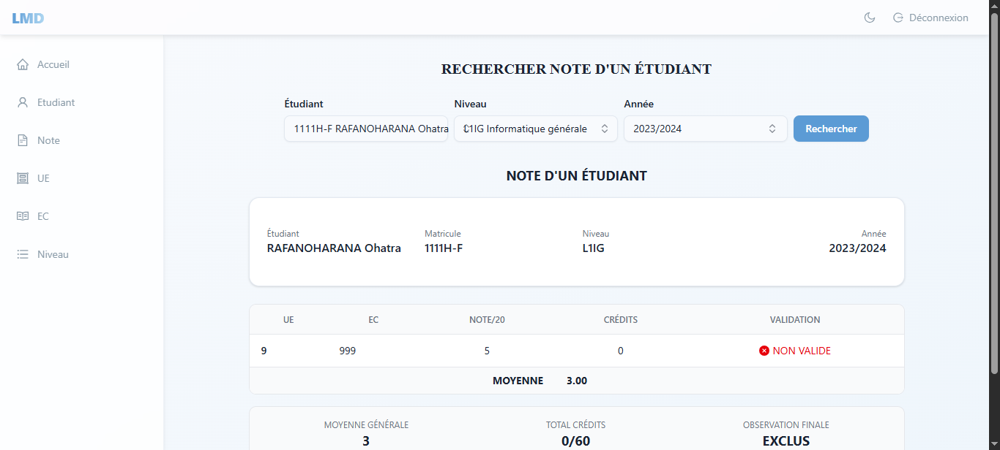 · 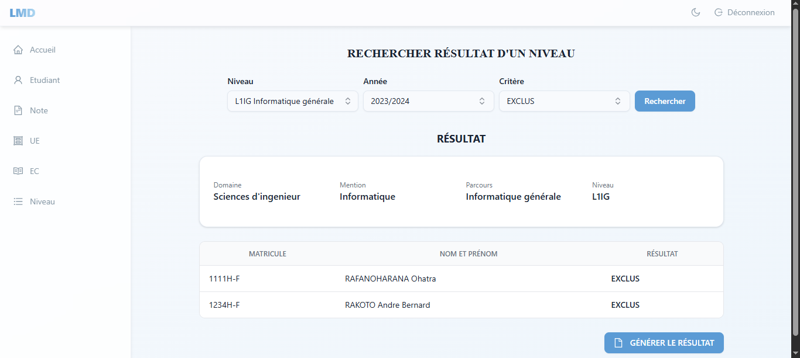

## 🧱 Tech Stack

| Layer | Library |
|-------|---------|
| Framework | React 19 |
| Language | TypeScript 5.7 |
| Build | Vite 6 |
| Routing | React Router v7 |
| Data Fetching | TanStack React Query v5 |
| HTTP | Axios |
| Forms | React Hook Form + Yup |
| UI | shadcn/ui (Radix) + Ant Design Icons |
| Styling | Tailwind CSS v4 |
| Date | dayjs / date-fns |
| Notifications | react-toastify |

## 📁 Project Structure

```
src/
├── api/            # Axios instances and API functions
├── components/     # Shared UI components (shadcn/ui + custom)
│   ├── shared/     # PageHeader, FormCard, FormField, DataTable, etc.
│   └── ui/         # Button, Input, Combobox, Dialog, etc.
├── constants/      # Enums and constant values
├── context/        # AuthContext and ThemeContext
├── hooks/          # React Query hooks for all CRUD operations
├── lib/            # Utility functions (cn)
├── Pages/          # Page components organized by feature
│   ├── admin/
│   ├── EC/
│   ├── Etudiant/
│   ├── Niveau/
│   ├── Note/
│   ├── NoteEtudiant/
│   └── UE/
├── routes/         # ProtectedRoute wrapper
├── types/          # TypeScript interfaces
├── utils/          # Format helpers, key press handlers
└── validation/     # Yup validation schemas
```

## ⭐️ Star

If you find this project useful, consider giving it a star — it helps motivate further development.
